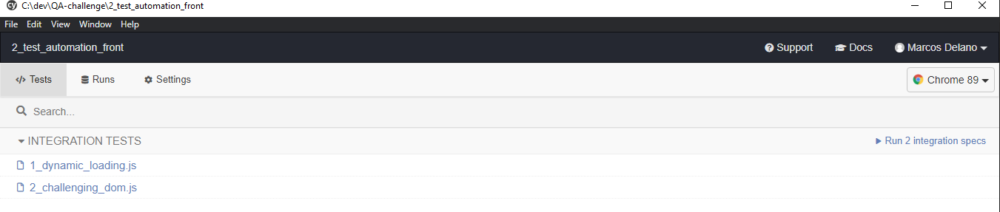
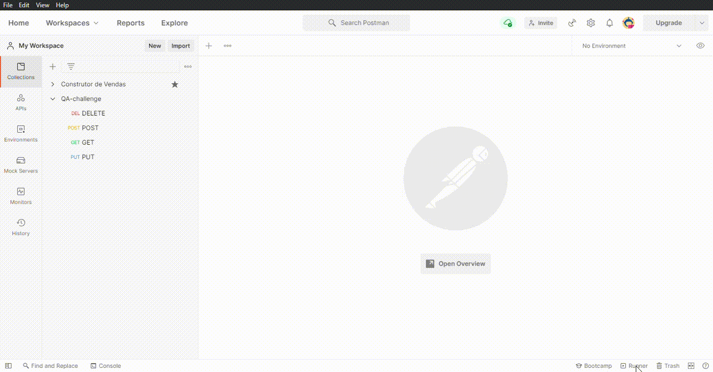

# Developed for Wealth Systems QA Challenge

Projeto feito para conclusão do desafio encontrado em https://github.com/WealthSystems/qa-challenge

## 1ª Etapa: Cenário de Testes

Cenários de testes baseado em prototipo localizado em /1_scenario/resume.feature.
## 2ª Etapa: Automação Front-end
Desafio 2 está na pasta /2_test_automation_front/cypress/integration.

Para automação desta etapa foi utilizado  o Cypress, framework javascript E2E para testes automatizados, instalado atráves de pacote NPM.

- Para execução do projeto, instalar Cypress na pasta /2_test_automation_front através do comando:

```
npm install cypress --save-dev
```
- Após instalado na pasta, abrir Cypress com o comando:
```
npx cypress open
```
- Em seguida, os testes salvos em /2_test_automation_front/cypress/integration serão exibidos e estão prontos para serem executados conforme requisitos especificados no desafio.


## 3ª Etapa: Automação Back-end (API)
Desafio 3 está na pasta /3_test_automation_front. Para conclusão deste desafio foi criada uma collection no Postman. Os testes escritos consistem na checagem do HTTP code e tempo de resposta. Resultados dos testes também foram exportados para "test_results_postman.json". JSON schemas validados em https://www.jsonschemavalidator.net/

- Com o Postman já instalado, em sua tela inicial terá a opção "import", na qual devemos importar o arquivo "collection.json" para validação dos testes.
- Com as collections já importadas, procuramos a opção runner e executamos a collection, e então os resultados dos testes serão exibidos conforme exemplo abaixo:
  


## Autor
* **Marcos Delano** - [marcosdelano.com](https://marcosdelano.com)
